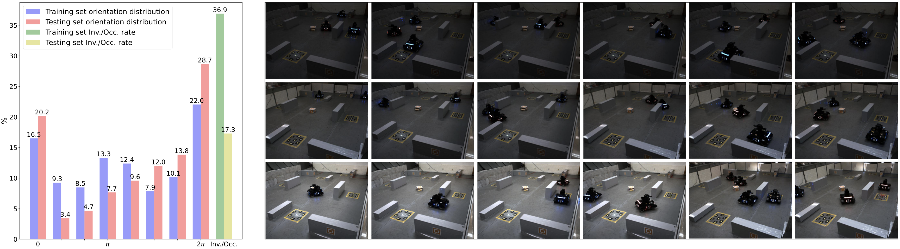

# MVM3Det: A Novel Framework for Multi-view Monocular 3D Object Detection

## Introduction

We propose a novel multi-view framework for occlusion free 3D detection and MVM3D dataset for multi-view detection in occlusion scenarios.

<div  align="center">    

</div>

## Table of content

## Content
- [MVM3Det code](#mvm3det-code)
    * [Usage](#usage)
    * [Training](#training)
    * [Inference](#inference)
    * [Credit](#credit)
- [MVM3D dataset](#mvm3d-dataset)
    * [Label infomation](#label-information)
    * [Downloads](#downloads)
    * [Toolkits](#toolkits)
    * [Evaluation Metrics](#evaluation-metrics)


## MVM3Det code

### Usage

*In progress...*

### Training

*In progress...*

### Inference

*In progress...*

### Credit

Our code mainly refers to these two repos: [MVDet](https://github.com/ZichengDuan/MVDet#mvdet-code) and [simple-faster-rcnn-pytorch](https://github.com/chenyuntc/simple-faster-rcnn-pytorch) and [3D-BoundingBox](https://github.com/skhadem/3D-BoundingBox). Some of the origin codes still exists in our implementation.


## MVM3D dataset

The MVM3D dataset is designed for multiview 3D detection in occlusion scenarios. Currently, monocular 3D detection dataset and multiview monocular detection dataset have thrived and emerged in recent years. However, less algorithms and datasets focus on 3D detection with occlusions. Inspired by [WildTrack](https://www.epfl.ch/labs/cvlab/data/data-wildtrack/), [MultiviewX](https://github.com/hou-yz/MultiviewX) and [RoboMaster Univeristy AI Challenge](https://www.robomaster.com/en-US/robo/icra), we develop a multiview monocular sentry detection dataset, **MVM3D** dataset.



The dataset is based on IEEE ICRA 2021 RoboMaster AI Challenge, including battle robot cars as detection targets and block obstacles as occlusion. The battleground is defined as a 4.49 meter by 8 meter plane ground, containing 9 fixed blocks as obstacles. The images are captured by 2 syncronized cameras, and the resolution of each image is 640 by 480, the image exposure time varies from 15000 microseconds to 30000 microseconds. The frame rate is 10 and each frame contains 1 to 4 robot cars as targets. 

*In progress...*

### Label information

1. Images from left and right cameras.
2. Ground truth label for:
   - Robot car world coordinates, denoted as [x, y].
   - Robot car orientations, calculated in radius.
   - Robot car classification labels, denoted as [0, 1, 2, 3].
   - 2D/3D/BEV bounding boxes.
   - Robot car 3D measurements.
3. Camera calibration matrix, including intrinsics and extrinsics.

### Downloads

Part of the data could be downloaded from [Baidu Netdisk](https://pan.baidu.com/s/1cL16r0gNa3lVBBdD-BaCTA) (Pwd: 0wp5) and [OneDrive](https://anu365-my.sharepoint.com/:u:/g/personal/u7170273_anu_edu_au/EZMfq2ku37NGtTTPK0Yn6ZEBjcaw-RTVqomjFp7W60NPUw?e=3v5muZ).

Note that this is **NOT** the final version of this dataset, more images and annotations are in progress.

### Toolkits

Some sample images and annotations are provided in [sample_datasets](sample_datasets/) folder.

By running the following command:

```markdown
cd sample_dataset
python visualize.py
```

The program are suppose to visualize the ground truth per-view 2D/3D boxes, birds-eye-view robot locations and orientations.

## Evaluation Metrics

For localization performance, we use the same evaluation metrics in [MultiviewX](https://github.com/hou-yz/MultiviewX) and [WildTrack](https://www.epfl.ch/labs/cvlab/data/data-wildtrack/) multiview pedestrian detection datasets, which are MODA, MODP, Precision and Recall. The evaluation toolkit could be referenced from [here](https://github.com/hou-yz/MVDet/tree/master/multiview_detector/evaluation).

For 3D detection metrics, we use AP, AOS and OS introduced in [KITTI](https://projet.liris.cnrs.fr/imagine/pub/proceedings/CVPR2012/data/papers/424_O3C-04.pdf) benchmark. The evaluation toolkit could be referenced from [here](https://www.mathworks.com/help/vision/ref/evaluatedetectionaos.html).

